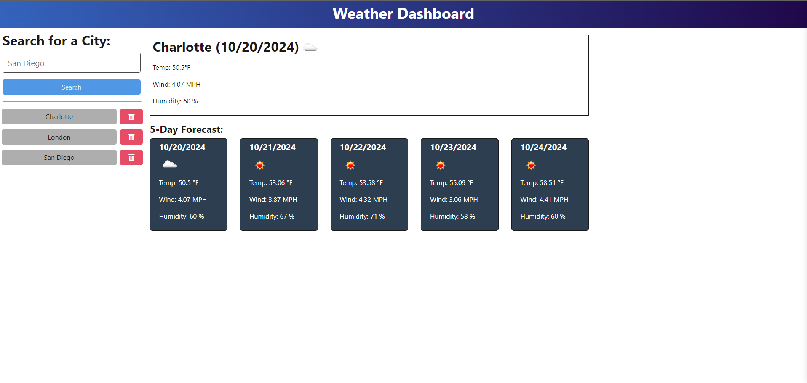

# Weather Dashboard

## Description

Weather Dashboard provides an intuitive 5-day forecast for searchable cities, retrieving real-time data from a weather API. Built with Node.js and Express, it efficiently routes data from the server to the client application. The application features fully functional CRUD endpoints, tested for reliability using Insomnia. With middleware and modular routing implemented, the architecture supports maintainability and scalability.

## Table of Contents

- [Installation](#installation)
- [Usage](#usage)
- [How to Contribute](#how-to-contribute)
- [Tests](#tests)
- [License](#license)
- [Questions](#questions)

## Installation

This application has been deployed using Render and can be accessed by navigating to the following link.
[Weather Dashboard](https://weather-dashboard-jm.onrender.com/)

## Usage

### Screenshot

### Usage Information
- Use the searchbox on the top left of the screen to search your desired city. 
- View the weather dashboard on search submission or by selecting a city from history. 
- There is a red button on each city in the search history list that can be used to delete from history.

## How to Contribute

Contribute freely! Please create an associated work ticket using GitHub's project management tools to track your changes.

## Tests

Endpoints are tested using Insomnia.

## License 
This application is covered under MIT License.
See the [full license](https://opensource.org/licenses/MIT) for more information.

## Questions

To reach me with additional questions please message me on either GitHub at jake-magri or via email jake.magri2@gmail.com.
